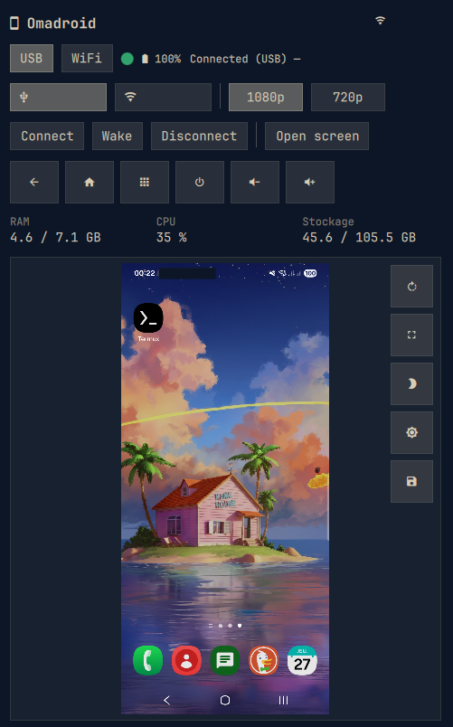

# 📱 Omadroid

An [Omarchy](https://omarchy.org) plugin to view and control an Android phone
right from the bar, using **scrcpy** and **ADB**.

The widget shows a 📱 icon in the bar. Clicking it opens a panel:

- **Top of the panel** — configuration (connection mode USB / WiFi, WiFi IP,
  scrcpy window size, Connect / Wake / Disconnect buttons, status).
- **Bottom of the panel** — a live preview of the phone screen + an **Open screen**
  button that launches the interactive scrcpy window.

The status line shows the connection type, device model and battery level, with
a colored dot (green = USB, orange = WiFi, red = disconnected). The last used
WiFi IP and mode are remembered between sessions.

> Unlocking the screen is done physically (fingerprint / PIN) on the device.
> The **Wake** button turns the screen on so the preview shows up.



---

## 🔒 Security

- **USB is the default transport** (most secure — no network traffic).
- **WiFi is opt-in** and must be enabled manually in the panel. It uses the
  standard ADB TCP/IP port `5555`.

---

## 🛠️ Prerequisites

| Tool | Install (Arch / Omarchy) |
|------|--------------------------|
| `adb` | `sudo pacman -S android-tools` |
| `scrcpy` | `sudo pacman -S scrcpy` |

**On the phone:**
- Enable **Developer options** (Settings → About phone → tap *Build number* 7 times).
- Enable **USB debugging** (Settings → Developer options). This is required for
  ADB/scrcpy to talk to the phone at all — nothing works without it.
- On Android 11+, also enable **Wireless debugging** if you plan to use WiFi mode
  without the USB bootstrap.
- Accept the ADB authorization prompt on first USB connection.

**WiFi mode (optional — less secure than USB):**
- The phone and the computer must be on the **same Wi-Fi network**.
- For the **first** WiFi connection, keep the phone plugged in over USB: the
  plugin enables ADB-over-TCP (`adb tcpip 5555`) through the USB link, then
  switches to WiFi. After that you can unplug and reconnect over WiFi using
  only the phone IP.
- Use a **stable IP** (static lease or DHCP reservation) so the IP does not
  change between sessions. If it changes, just update the IP field in the panel.
- If your phone runs Android 11+, you can also pair via **Wireless debugging**
  (Settings → Developer options) instead of the USB bootstrap.

**Quality (optional):** Omadroid already launches scrcpy with good defaults
(`--max-size 1080 --video-bit-rate 16M --max-fps 60`). To override or add
scrcpy flags, export `SCRCPY_OPTS` in your shell. The plugin appends it to the
command it builds.

```sh
# bash  → add to ~/.bashrc
# zsh   → add to ~/.zshrc
export SCRCPY_OPTS="--max-fps 60 --video-bit-rate 8M"
```

> Note: the variable above only reaches the plugin if it is exported in the
> session that starts Omarchy (your shell rc, or the environment of your
> display manager / WM). Since Omadroid already ships sensible quality defaults,
> this is optional.

---

## 🚀 Install

```sh
omarchy plugin add https://github.com/tug-benson/omadroid.git --enable
```

The widget appears in the `right` section of the bar (move it with
`omarchy bar move com.github.tug-benson.omadroid --section <left|center|right>`).

---

## 💡 Usage

1. Plug the phone in over USB and accept the ADB authorization.
2. Click the 📱 icon → the panel shows the live preview.
3. Click **Open screen** to launch the interactive scrcpy window
   (size is adjustable, ~6–8″ equivalent by default).
4. Unlock the phone physically, then use it like a window.

**WiFi mode (optional):** in the panel, pick **WiFi**, enter the phone IP, click
**Connect**. The first time, the phone must be plugged in over USB (the plugin
enables TCP/IP via USB, then switches to WiFi).

---

## ⌨️ Keyboard shortcut (open screen directly)

The plugin can open the scrcpy window straight from a keybinding. Add it to
your Hyprland Lua config (`~/.config/hypr/bindings.lua`):

```lua
-- Free the combo used by the ChatGPT plugin, then bind it to Omadroid
hl.unbind("SUPER + SHIFT + A")
o.bind("SUPER + SHIFT + A", "Omadroid (open screen)", "$HOME/.config/omarchy/plugins/com.github.tug-benson.omadroid/scripts/omadroid.sh open")
```

`open` auto-detects the transport: it uses a plugged-in USB device, or falls
back to the saved WiFi IP. Set `SCRCPY_OPTS` (see Quality above) in the session
that starts Omarchy to tune it. Pick any free key combo — change
`SUPER + SHIFT + A` if that binding is already taken.

## ✨ Features

- **USB by default, WiFi optional** (remembers the last WiFi IP and mode).
- **Auto-connect over WiFi** when you open the panel and an IP is known.
- **Multiple devices**: if several phones are detected, a device picker lets
  you choose which one to mirror.
- **Resolution toggle** for the scrcpy window: **1080p** / **720p**.
- **Live preview** with **Rotate** (⟳) and **Expand** (▣) controls.
- **Direct touch control**: tap and swipe directly on the preview to drive the
  phone (maps to `adb input tap` / `swipe`, accounting for preview rotation).
- **Save snapshot**: the 💾 button copies the current preview to
  `~/Pictures/omadroid-<timestamp>.png` (handy for grabbing a clean wallpaper
  shot without the apps).
- **Battery level** and a colored connection indicator in the status line.

## ⚙️ Configuration

Settings (WiFi IP, max size, mode) are persisted to
`~/.config/omarchy/omadroid.conf`.

| Setting | Description | Default |
|---------|-------------|---------|
| Mode | USB (default) or WiFi | `usb` |
| WiFi IP | Phone address in WiFi mode | _(empty)_ |
| Resolution | `--max-size` of the scrcpy window (`1080` or `720`) | `1080` |

---

## 🔧 Troubleshooting

**The phone is not detected (status: "Not connected"):**
- Make sure **USB debugging** is enabled and you accepted the authorization
  prompt on the phone (Settings → Developer options).
- Try a different cable / port, then restart the ADB server:
  ```sh
  adb kill-server && adb start-server
  adb devices
  ```
- The widget only lists devices shown by `adb devices` as `device`.

**WiFi mode won't connect:**
- The **first** WiFi connection must happen while the phone is plugged in over
  USB (the plugin runs `adb tcpip 5555` through the USB link). After that, WiFi
  works on its own.
- Check the IP is correct and the phone is on the **same network** as the PC.
- On Android 11+, you can instead pair via **Wireless debugging** (Developer
  options) so no USB bootstrap is needed.
- Manually verify with: `adb connect <ip>:5555`.

**Preview is blank / "Preview unavailable":**
- The screen may be off — click **Wake** to turn it on.
- Over WiFi, enable **USB debugging (Security settings)** on the phone if you
  want the preview/controls to work without re-authorizing after each unlock.

**"Open screen" does nothing:**
- `scrcpy` must be installed (`pacman -S scrcpy`).
- A device must be connected (USB or WiFi) before opening.
- A typo in `SCRCPY_OPTS` can make scrcpy exit immediately — test your flags
  from a terminal first.

**Touch control on the preview does not react:**
- The device must be connected and authorized.
- Over WiFi, inputs are blocked until the device is unlocked at least once, or
  **USB debugging (Security settings)** is enabled.

**The widget does not appear in the bar:**
- Run `omarchy plugin validate com.github.tug-benson.omadroid` and
  `omarchy restart shell`.
- Make sure the plugin is enabled: `omarchy plugin list`.

**The keyboard shortcut does nothing:**
- Confirm the script path in your Hyprland bind matches the installed plugin
  directory.
- After editing the bind, reload Hyprland (or log out/in).

---

## 🗑️ Uninstall

```sh
omarchy plugin remove com.github.tug-benson.omadroid
```

---

## 📄 License

MIT — see [LICENSE](LICENSE).
